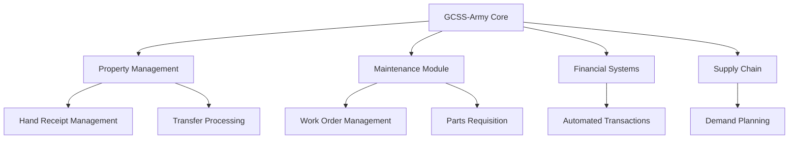

# The Great Migration: From PBUSE to GCSS-Army - Lessons from the Frontlines of Military IT Transformation

*Published: October 15, 2016*  
*Author: Fernando A. McKenzie*  
*Read Time: 14 min*  
*Tags: Military IT, ERP Systems, Supply Chain, Digital Transformation*

---

## Introduction: The Largest ERP Migration in Army History

As we stand in the middle of 2016, the U.S. Army is undertaking what will become the largest enterprise resource planning (ERP) deployment in its history. The Global Combat Support System-Army (GCSS-Army) migration represents more than just a software upgrade—it's a fundamental transformation of how the Army manages its supply chain, property accountability, and maintenance operations.

Having worked through Wave 1's completion in 2015 and now deep into Wave 2 implementation, I've witnessed firsthand the challenges, victories, and critical lessons learned from migrating thousands of units from legacy systems like Property Book Unit Supply Enhanced (PBUSE) to this modern, integrated platform.

## The Legacy Challenge: Why PBUSE Had to Go

For over two decades, PBUSE served as the backbone of Army property accountability. While reliable in its time, by 2016 the system's limitations had become critical bottlenecks:

### Technical Debt Accumulation
- **DOS-based architecture** struggling with modern hardware
- **Limited integration capabilities** with newer Army systems
- **Manual workarounds** consuming excessive administrative time
- **Data silos** preventing enterprise-wide visibility

### Operational Constraints
```
Daily PBUSE Workflow (Pre-GCSS):
1. Manual data entry across multiple systems
2. Paper-based hand receipts and transfers
3. Separate maintenance tracking in SAMS-E
4. End-of-month reconciliation nightmares
5. Limited real-time visibility for commanders
```

The writing was on the wall: PBUSE couldn't scale to meet 21st-century operational demands.

## GCSS-Army: More Than Just a System Replacement

GCSS-Army isn't simply PBUSE with a modern interface. It represents a complete paradigm shift toward integrated supply chain management:

### Core Capabilities
- **Real-time inventory visibility** across all echelons
- **Integrated maintenance management** replacing SAMS-E
- **Automated financial transactions** and reconciliation
- **Mobile-enabled** operations for field environments
- **Enterprise-wide reporting** and analytics

### The Two-Wave Strategy

**Wave 1 (Completed 2015):**
- Retail supply operations
- Financial management functions
- Replaced Standard Army Retail Supply System

**Wave 2 (2016-2017 Implementation):**
- Property book operations (PBUSE replacement)
- Maintenance management (SAMS-E replacement)
- Full enterprise integration

## 2016: The Critical Year - Wave 2 Implementation

### The Challenge Scale
As of mid-2016, we're managing the migration of:
- **240+ Army installations** worldwide
- **500,000+ pieces of equipment** requiring re-accountability
- **50,000+ supply personnel** needing retraining
- **Legacy data** spanning decades of operations

### Implementation Methodology

**Phase 1: Infrastructure Preparation**
```bash
# Network upgrades for GCSS-Army requirements
- Bandwidth assessments and upgrades
- Server infrastructure deployment
- Security protocol implementation
- Backup and disaster recovery planning
```

**Phase 2: Data Migration**
The most critical and complex phase:
- PBUSE database extraction and cleaning
- Data format standardization
- Property accountability reconciliation
- Historical maintenance record preservation

**Phase 3: User Training**
- Role-based training programs
- Hands-on laboratory exercises
- Unit-specific workflow development
- Mentorship programs with Wave 1 units

**Phase 4: Go-Live Support**
- 24/7 help desk operations
- On-site support teams
- Real-time issue resolution
- Performance monitoring

## Real-World Implementation Challenges

### Data Quality Issues
The migration revealed decades of data inconsistencies:

```sql
-- Example data cleaning challenge
SELECT COUNT(*) FROM property_records 
WHERE serial_number IS NULL 
   OR serial_number = 'N/A'
   OR serial_number = 'UNKNOWN';
-- Result: 47,892 records requiring manual research
```

**Resolution Strategy:**
- Cross-reference with maintenance records
- Physical equipment verification
- Command-level data validation
- Automated data quality rules implementation

### Training Resistance
Moving from PBUSE's familiar (if clunky) interface to GCSS-Army's modern workflow created initial resistance:

**Common Concerns:**
- "PBUSE may be slow, but I know exactly how it works"
- "This new system has too many steps"
- "What happens if GCSS-Army goes down?"

**Mitigation Strategies:**
- Champion identification within each unit
- Comparative workflow demonstrations
- Success story sharing from Wave 1 units
- Continuous feedback incorporation

### Network Dependencies
GCSS-Army's real-time capabilities require robust network infrastructure:

**Infrastructure Challenges:**
- Remote installation connectivity
- Deployment environment operations
- Redundancy and failover planning
- Security compliance in tactical networks

## Success Metrics and Early Wins

### Quantifiable Improvements
Six months into Wave 2 implementation, early adopter units report:

- **75% reduction** in monthly property book reconciliation time
- **90% decrease** in hand receipt processing errors
- **Real-time visibility** replacing week-old PBUSE reports
- **Integrated maintenance** eliminating dual-system entry

### Operational Benefits
```
Before (PBUSE):
- Property transfer: 2-3 days
- Maintenance request: 4-6 hours
- Monthly reconciliation: 40+ hours
- Report generation: Manual, 2-4 hours

After (GCSS-Army):
- Property transfer: 2-3 hours
- Maintenance request: 15-30 minutes
- Monthly reconciliation: 4-6 hours
- Report generation: Real-time, automated
```

## Technical Architecture Deep Dive

### System Integration
GCSS-Army's power lies in its integration capabilities:



### Performance Optimization
Key technical considerations for successful deployment:

**Database Optimization:**
- Partitioned tables for historical data
- Optimized indexing strategies
- Regular maintenance procedures
- Performance monitoring dashboards

**Network Architecture:**
- Redundant connectivity paths
- Quality of Service (QoS) prioritization
- Edge caching for remote locations
- Disaster recovery site synchronization

## Change Management: The Human Element

### Cultural Transformation
Beyond technology, GCSS-Army requires fundamental changes in how units operate:

**Old PBUSE Mindset:**
- Monthly batch processing acceptable
- Manual verification standard practice
- System downtime expected and planned for
- Individual unit autonomy in procedures

**New GCSS-Army Culture:**
- Real-time data expectations
- Automated verification with exception handling
- High availability requirements
- Standardized enterprise procedures

### Leadership Engagement
Successful implementations require active command involvement:

**Critical Success Factors:**
- Command emphasis on training completion
- Resource allocation for implementation
- Patience during learning curve periods
- Celebration of early wins and improvements

## Lessons Learned: What Works and What Doesn't

### Successful Strategies

**1. Phased Implementation**
Rather than "big bang" cutover, successful units use parallel operations:
- Run PBUSE and GCSS-Army simultaneously
- Gradually shift workflows to new system
- Maintain backup procedures during transition

**2. Local Champions**
Identify and empower super-users within each unit:
- Technical expertise development
- Peer-to-peer training delivery
- Local problem resolution
- Feedback collection and escalation

**3. Realistic Timelines**
Initial estimates proved optimistic; successful units plan for:
- 3-6 months for full proficiency
- 20-30% productivity decrease during first month
- Ongoing training and refinement needs

### Common Pitfalls

**1. Inadequate Data Preparation**
Units rushing into implementation without proper data cleaning face:
- Extended reconciliation periods
- Reduced user confidence
- Increased help desk tickets
- Potential rollback scenarios

**2. Insufficient Training**
Role-based training proves critical:
- Generic training insufficient for specialized roles
- Hands-on practice essential
- Scenario-based exercises more effective than lecture-style training

**3. Network Infrastructure Assumptions**
GCSS-Army's requirements exceed many legacy network capabilities:
- Bandwidth assessments critical
- Latency impacts user experience
- Redundancy planning essential
- Security requirements may limit connectivity options

## Looking Forward: The Path to Full Implementation

### 2017 Completion Timeline
Current projections target November 2017 for full GCSS-Army deployment:

**Remaining Milestones:**
- Q4 2016: Complete 80% of installations
- Q1 2017: Address major integration issues
- Q2 2017: Performance optimization and tuning
- Q3 2017: Final unit conversions
- Q4 2017: Legacy system retirement

### Post-Implementation Vision
Once fully deployed, GCSS-Army promises to deliver:

**Enterprise Capabilities:**
- Army-wide inventory visibility
- Predictive maintenance analytics
- Automated supply chain optimization
- Real-time readiness reporting

**Financial Benefits:**
- Legacy system retirement cost savings
- Reduced administrative overhead
- Improved audit compliance
- Enhanced fraud detection

## Recommendations for Future Large-Scale Migrations

### Technical Recommendations

**1. Infrastructure First**
- Complete network upgrades before application deployment
- Implement monitoring and alerting systems
- Establish robust backup and recovery procedures
- Plan for scalability from day one

**2. Data Quality Investment**
- Allocate significant time for data cleaning
- Implement automated data validation
- Establish data governance procedures
- Plan for ongoing data quality maintenance

### Organizational Recommendations

**1. Change Management Priority**
- Invest heavily in training and communication
- Identify and develop local champions
- Plan for extended transition periods
- Maintain morale during difficult phases

**2. Leadership Commitment**
- Ensure command-level support and resources
- Communicate vision and benefits regularly
- Address concerns and resistance proactively
- Celebrate successes and learn from failures

## Conclusion: Transformation in Progress

As we navigate through 2016, the GCSS-Army migration represents more than a technology upgrade—it's a fundamental transformation of Army logistics operations. While challenges remain significant, the early results from Wave 2 implementation demonstrate the system's potential to revolutionize how we manage property, maintenance, and supply operations.

The lessons learned during this migration will inform military IT transformations for decades to come. Most importantly, we're proving that large-scale enterprise system migrations are possible in complex, distributed organizations like the U.S. Army.

**Key Takeaways:**
- Technical excellence must be paired with change management
- Data quality determines implementation success
- User training and support are ongoing requirements
- Leadership engagement is non-negotiable
- Patience and persistence are essential virtues

The journey from PBUSE to GCSS-Army continues, but the destination—a modern, integrated, enterprise-ready logistics system—justifies the effort required to get there.

---

*Fernando A. McKenzie is an IT Operations Specialist with extensive experience in military logistics systems and enterprise software deployments. He currently supports GCSS-Army implementation across multiple Army installations.* 